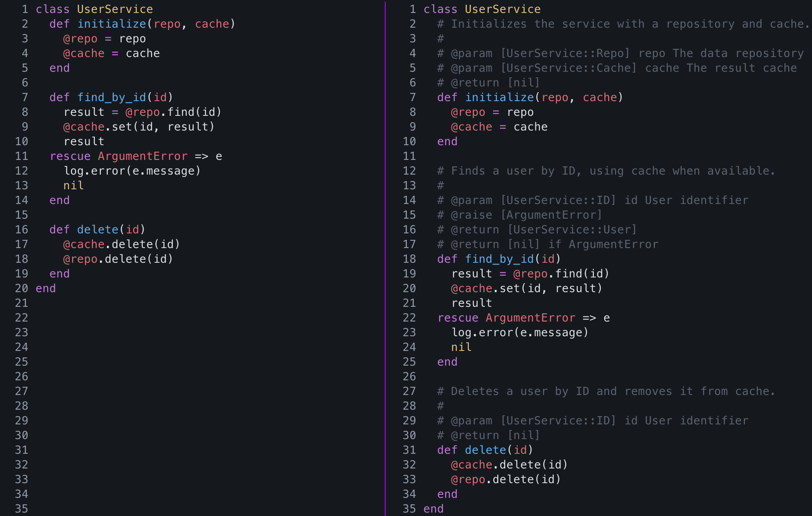

<p align="center">
  
</p>

<h1 align="center">DocScribe</h1>

<p align="center">
<a href="https://rubygems.org/gems/docscribe"></a>
<a href="https://rubygems.org/gems/docscribe"></a>
<a href="https://github.com/unurgunite/docscribe/actions/workflows/ci.yml"></a>
<a href="https://github.com/unurgunite/docscribe/blob/master/LICENSE.txt"></a>
<a href="#installation"></a>
<a href="https://marketplace.visualstudio.com/items?itemName=unurgunite.docscribe-vscode"></a>
<a href="https://plugins.jetbrains.com/plugin/32349-docscribe"></a>
</p>



Generate inline, YARD-style documentation comments for Ruby methods by analyzing your code's AST.

Docscribe inserts doc headers before method definitions, infers parameter and return types (including rescue-aware
returns), and respects Ruby visibility semantics — without using YARD to parse.

- No AST reprinting. Your original code, formatting, and constructs (like `class << self`, `heredocs`, `%i[]`) are
  preserved.
- Inline-first. Comments are inserted before method headers without reprinting the AST. For methods with a leading
  Sorbet `sig`, new docs are inserted above the first `sig`.
- Heuristic type inference for params and return values, including conditional returns in rescue branches.
- Safe and aggressive update modes:
    - safe mode inserts missing docs, merges existing doc-like blocks, and normalizes sortable tags;
    - aggressive mode rebuilds existing doc blocks.
- Ruby 3.4+ syntax supported using Prism translation (see "Parser backend" below).
- Optional external type integrations:
    - RBS via `--rbs` / `--sig-dir`;
    - Sorbet via inline `sig` declarations and RBI files with `--sorbet` / `--rbi-dir`.
- Optional `@!attribute` generation for:
    - `attr_reader` / `attr_writer` / `attr_accessor`;
    - `Struct.new` declarations in both constant-assigned and class-based styles.

> [!NOTE]
> Docscribe is under **active development**. If you run into any edge cases or have ideas for improvement, feel free to
> [open an issue](https://github.com/unurgunite/docscribe/issues/new) or submit a pull request.

Common workflows:

- Inspect what safe doc updates would be applied: `docscribe lib`
- Apply safe doc updates: `docscribe -a lib`
- Apply aggressive doc updates: `docscribe -A lib`
- Use RBS gem collection signatures: `docscribe -a --rbs-collection lib`
- Use RBS signatures when available: `docscribe -a --rbs --sig-dir sig lib`
- Use Sorbet signatures when available: `docscribe -a --sorbet --rbi-dir sorbet/rbi lib`

## Quick start

```shell
# Check what safe doc updates would be applied
docscribe lib

# Apply safe updates (insert missing docs, merge existing)
docscribe -a lib

# Rebuild all doc blocks aggressively
docscribe -A lib
```

> [!TIP]
> See [CLI](#cli) for all options and [Update strategies](#update-strategies) for the
> difference between safe and aggressive modes.
>
> Want IDE integration? Check out
> the [VS Code](https://marketplace.visualstudio.com/items?itemName=unurgunite.docscribe-vscode)
> and [RubyMine](https://plugins.jetbrains.com/plugin/32349-docscribe) plugins.

## Contents

* [Quick start](#quick-start)
* [Contents](#contents)
* [Installation](#installation)
* [Architecture](#architecture)
    * [Data flow](#data-flow)
* [CLI](#cli)
    * [Exit codes](#exit-codes)
    * [Options](#options)
    * [Examples](#examples)
    * [`docscribe sigs` — check RBS signature coverage](#docscribe-sigs--check-rbs-signature-coverage)
    * [`docscribe rbs` — generate RBS from YARD](#docscribe-rbs--generate-rbs-from-yard)
    * [`docscribe update_types` — two-pass type-aware documentation update](#docscribe-update_types--two-pass-type-aware-documentation-update)
    * [`docscribe check_for_comments` — find placeholder documentation](#docscribe-check_for_comments--find-placeholder-documentation)
    * [`docscribe init` — project scaffolding](#docscribe-init--project-scaffolding)
    * [`docscribe config` — view resolved configuration](#docscribe-config--view-resolved-configuration)
    * [`docscribe coverage` — documentation coverage report](#docscribe-coverage--documentation-coverage-report)
    * [`docscribe server` — persistent daemon mode](#docscribe-server--persistent-daemon-mode)
* [Update strategies](#update-strategies)
    * [Safe strategy](#safe-strategy)
    * [Aggressive strategy](#aggressive-strategy)
    * [Output markers](#output-markers)
* [Tips & tricks](#tips--tricks)
* [Parser backend (Parser gem vs Prism)](#parser-backend-parser-gem-vs-prism)
* [External type integrations (optional)](#external-type-integrations-optional)
    * [RBS](#rbs)
        * [RBS collection auto-discovery](#rbs-collection-auto-discovery)
    * [Sorbet](#sorbet)
    * [Inline Sorbet example](#inline-sorbet-example)
    * [Sorbet RBI example](#sorbet-rbi-example)
    * [Sorbet comment placement](#sorbet-comment-placement)
    * [Generic type formatting](#generic-type-formatting)
    * [Notes and fallback behavior](#notes-and-fallback-behavior)
* [Type inference](#type-inference)
* [Rescue-aware returns and @raise](#rescue-aware-returns-and-raise)
* [Visibility semantics](#visibility-semantics)
* [API (library) usage](#api-library-usage)
* [Plugin system](#plugin-system)
    * [TagPlugin](#tagplugin)
    * [CollectorPlugin](#collectorplugin)
        * [Plugin doc normalization (CollectorPlugin)](#plugin-doc-normalization-collectorplugin)
        * [`method_override` (structured patch)](#method_override-structured-patch)
    * [Registering plugins](#registering-plugins)
    * [Plugin priority](#plugin-priority)
    * [Idempotency](#idempotency)
    * [Plugin examples](#plugin-examples)
* [Configuration](#configuration)
    * [Anonymous block parameters](#anonymous-block-parameters)
    * [Filtering](#filtering)
    * [`attr_*` example](#attr_-example)
    * [`Struct.new` examples](#structnew-examples)
        * [Constant-assigned struct](#constant-assigned-struct)
        * [Class-based struct](#class-based-struct)
    * [Merge behavior](#merge-behavior)
    * [Param tag style](#param-tag-style)
    * [Create a starter config](#create-a-starter-config)
    * [Generate a plugin skeleton](#generate-a-plugin-skeleton)
    * [Full configuration reference](#full-configuration-reference)
* [CI integration](#ci-integration)
* [Comparison to YARD's parser](#comparison-to-yards-parser)
* [Limitations](#limitations)
* [Roadmap](#roadmap)
* [Editor Integration](#editor-integration)
    * [VS Code](#vs-code)
    * [RubyMine](#rubymine)
* [Contributing](#contributing)
* [Discussion & Community](#discussion--community)
* [Logo Attribution](#logo-attribution)
* [License](#license)

## Installation

Add to your Gemfile:

```ruby
gem "docscribe"
```

Then:

```shell
bundle install
```

Or install globally:

```shell
gem install docscribe
```

Requires Ruby 2.7+.

## Architecture

Docscribe is organized into several subsystems. The CLI layer receives user input and orchestrates configuration
loading, then delegates to the core engine which parses source code, collects methods (using an AST walker), builds YARD
doc lines — combining heuristic type inference, external RBS/Sorbet signatures, and plugin output — and finally rewrites
the source via a strategy (safe merge or aggressive replace).

In server mode, a persistent daemon (`docscribe server`) keeps the runtime loaded and caches parsed results across
invocations via an LRU cache, enabling near-instant repeated checks for IDE plugins. A thin client (`docscribe-client`)
provides minimal-overhead socket communication without loading the full gem.

```mermaid
flowchart TB
    subgraph CLI["CLI Layer"]
        Exe["exe/docscribe\nEntry point"]
        Run["CLI::Run\nMain execution\n· expand paths\n· iterate files\n· report results"]
        Options["CLI::Options\nARGV parsing\n(mode, strategy,\nfilters, flags)"]
        InitCmd["CLI::Init\ndocscribe init\nGenerate config"]
        GenCmd["CLI::Generate\ndocscribe generate\nScaffold plugins"]
        SigsCmd["CLI::Sigs\ndocscribe sigs\nCheck RBS coverage"]
        RbsGenCmd["CLI::RbsGen\ndocscribe rbs\nGenerate RBS from YARD"]
        SarifFormatter["CLI::Formatters::Sarif\nSARIF 2.1 JSON\nCode Scanning"]
        ConfigBuilder["CLI::ConfigBuilder\nApply CLI overrides\nto config"]
    end

    subgraph Config["Configuration"]
        ConfigClass["Config\nCentral config object\n· raw hash\n· query methods"]
        Defaults["config/defaults.rb\nDEFAULT hash"]
        Loader["config/loader.rb\nYAML loading\n+ deep merge"]
        Emit["config/emit.rb\nEmission toggles\n(header, tags, etc.)"]
        Filtering["config/filtering.rb\nFile/method\ninclude/exclude"]
        RBSConfig["config/rbs.rb\nRBS provider\nfactory"]
        SorbetConfig["config/sorbet.rb\nSorbet provider\nchain factory"]
        PluginConfig["config/plugin.rb\nPlugin loading\nfrom YAML"]
    end

    subgraph Parsing["Parsing"]
        ParsingModule["Parsing\nBackend selection\n(:parser / :prism)"]
        ParserGem["Parser gem\n(whitequark/parser)"]
        Prism["Prism translator\n(Ruby 3.4+)"]
    end

    subgraph Core["Core Engine"]
        InlineRewriter["InlineRewriter\n· parse -> collect\n· deduplicate -> dispatch\n· rewrite"]
        Collector["Collector\n< Parser::AST::Processor\nAST walker\n· find methods/attrs\n· track visibility\n· track containers"]
        DocBuilder["DocBuilder\nGenerate YARD doc lines\n· combine inference\n· external signatures\n· plugin tags"]
        DocBlock["DocBlock\nSafe strategy:\nparse -> merge -> sort\nexisting doc blocks"]
        SourceHelpers["SourceHelpers\nPosition/range\nutilities"]
    end

    subgraph Infer["Inference Engine"]
        InferModule["Infer\nEntry point"]
        Params["Infer::Params\nParameter type\nfrom name + default"]
        Returns["Infer::Returns\nReturn type\nfrom method body"]
        Raises["Infer::Raises\n@raise tags\nfrom raise/rescue"]
        Literals["Infer::Literals\nAST literal ->\ntype string"]
        Names["Infer::Names\n:const node ->\nFQN string"]
        ASTWalk["Infer::ASTWalk\nRecursive DFS\nAST traversal"]
    end

    subgraph Plugins["Plugin System"]
        PluginModule["Plugin\nTag/Collector\ndispatch"]
        Registry["Plugin::Registry\nGlobal registry\n· register -> route\n· tag_entries\n· collector_entries"]
        TagPlugin["Base::TagPlugin\nOverride #call(context)\n-> Array<Tag>"]
        CollectorPlugin["Base::CollectorPlugin\nOverride #collect(ast, buffer)\n-> Array<Hash>"]
        TagValue["Plugin::Tag\nStruct (name, text, types)"]
        Context["Plugin::Context\nMethod snapshot struct"]
    end

    subgraph Types["External Type System"]
        ProviderChain["ProviderChain\nComposite:\nquery in order\nfirst match wins"]
        RBSProvider["RBS::Provider\n.rbs files\n-> RBS lib"]
        RBSFormatter["RBS::TypeFormatter\nRBS type ->\nYARD type string"]
        RBSCollection["RBS::CollectionLoader\nrbs_collection\n.lock.yaml"]
        SorbetBase["Sorbet::BaseProvider\nRBS::Prototype::RBI\nbridge"]
        SorbetSource["Sorbet::SourceProvider\nInline sig{}\ndeclarations"]
        SorbetRBI["Sorbet::RBIProvider\n.rbi files\ndirectories"]
    end

    subgraph YardTypes["YARD Type Parser"]
        YParser["Yard::Parser\nParse YARD type\nstrings -> AST"]
        YFormatter["Yard::Formatter\nYARD AST ->\nRBS string"]
        YTypes["Yard::Types\n9 AST node types\n(Named, Generic, etc.)"]
    end

    subgraph Server["Server / Daemon"]
        ThinClient["exe/docscribe-client\nThin client\n· socket send/receive\n· no gem load"]
        ServerDaemon["Server::Daemon\nSocket listener\n· check / fix / shutdown\n· JSON-RPC 2.0"]
        Cache["Docscribe::LRUCache\nFile result cache\n(max 1000, by mtime)"]
    end

    Exe --> Run
    Exe --> ServerDaemon
    ThinClient --> ServerDaemon
    ServerDaemon --> ConfigClass
    ServerDaemon --> Cache
    ServerDaemon --> InlineRewriter
    Run --> Options
    Run --> InitCmd
    Run --> GenCmd
    Run --> SigsCmd
    Run --> RbsGenCmd
    Run --> SarifFormatter
    Run --> ConfigBuilder
    ConfigBuilder --> ConfigClass
    ConfigBuilder --> ServerDaemon
    ConfigClass --> Defaults
    ConfigClass --> Loader
    ConfigClass --> Emit
    ConfigClass --> Filtering
    ConfigClass --> RBSConfig
    ConfigClass --> SorbetConfig
    ConfigClass --> PluginConfig
    Run --> InlineRewriter
    InlineRewriter --> ParsingModule
    ParsingModule --> ParserGem
    ParsingModule --> Prism
    InlineRewriter --> Collector
    Collector --> PluginModule
    PluginModule --> Registry
    Registry --> CollectorPlugin
    InlineRewriter --> DocBuilder
    DocBuilder --> InferModule
    InferModule --> Params
    InferModule --> Returns
    InferModule --> Raises
    Params --> Literals
    Returns --> Literals
    Raises --> ASTWalk
    Raises --> Names
    DocBuilder --> ProviderChain
    ProviderChain --> SorbetSource
    ProviderChain --> SorbetRBI
    ProviderChain --> RBSProvider
    SorbetSource --> SorbetBase
    SorbetRBI --> SorbetBase
    RBSProvider --> RBSFormatter
    RBSProvider --> RBSCollection
    DocBuilder --> PluginModule
    PluginModule --> Registry
    Registry --> TagPlugin
    TagPlugin --> TagValue
    TagPlugin --> Context
    InlineRewriter --> DocBlock
    InlineRewriter --> SourceHelpers
    RbsGenCmd --> ParsingModule
    RbsGenCmd --> YParser
    YParser --> YTypes
    YParser --> YFormatter
```



### Data flow

```mermaid
flowchart LR
    subgraph Entry["Entry Points"]
        Direct["docscribe lib\n(no --server)"]
        ViaServer["docscribe --server\nor docscribe-client"]
    end

    subgraph Daemon["Server Daemon (Unix Socket)"]
        Socket["Daemon#listen_loop\nJSON-RPC 2.0 dispatch"]
        CacheCheck{"File cached &\nmtime fresh?"}
        CacheStorage["LRUCache\n(1000 entries)"]
        ApplyOverrides["apply_cli_overrides\n(reset on nil)"]
    end

    ViaServer --> Socket
    Socket --> ApplyOverrides
    ApplyOverrides --> CacheCheck
    CacheCheck -->|Hit| Socket
    CacheCheck -->|Miss| Parse
    Direct --> Parse
    Parse["Parsing.parse_buffer\nParser gem / Prism"]
    Parse --> AST["AST + Comments"]
    AST --> Collect["Collector.process\n· Find methods\n· Track visibility\n· Find attr_*"]
    AST --> CollectPlugins["CollectorPlugin#collect\n· Custom AST walks\n· Non-standard constructs"]
    Collect --> Insertions["Insertion list\n(sorted by position)"]
    CollectPlugins --> Insertions
    Insertions --> Dedup["Deduplicate\n(override by position)"]
    Dedup --> Build["DocBuilder.build_doc_lines\nper insertion"]
    Build --> Infer["Infer params / returns / raises\n(heuristic fallback)"]
    Build --> SigQuery["ProviderChain\nquery external types"]
    Build --> TagPlugins["TagPlugin#call\n(add extra @tags)"]
    Infer --> ResultDoc["Generated YARD doc block"]
    SigQuery --> ResultDoc
    TagPlugins --> ResultDoc
    ResultDoc --> Strategy{"Strategy?"}
    Strategy -->|Safe| Merge["DocBlock.merge\npreserve + append + sort"]
    Strategy -->|Aggressive| Replace["Replace entirely"]
    Merge --> Rewritten["Rewriter#process\n-> rewritten source"]
    Replace --> Rewritten
    Rewritten --> Result["Result / response"]
    Rewritten --> CacheStorage
    CacheStorage --> Socket
    Result -->|Direct mode| Output["Modified .rb file / STDOUT"]
    Result -->|Server mode| Socket
```



## CLI

```shell
docscribe [options] [files...]
docscribe init [options]
docscribe generate [type] [name] [options]
docscribe sigs [options] [files...]
docscribe rbs [options] [files...]
docscribe update_types [directory]
docscribe check_for_comments [paths...]
docscribe server [start|status|stop] [options]
```

Docscribe has three main ways to run:

- **Inspect mode** (default): checks what safe doc updates would be applied and exits 1 if files need changes.
- **Safe autocorrect** (`-a`, `--autocorrect`): writes safe, non-destructive updates in place.
- **Aggressive autocorrect** (`-A`, `--autocorrect-all`): rewrites existing doc blocks more aggressively.
- **STDIN mode** (`--stdin`): reads Ruby source from STDIN and prints rewritten source to STDOUT.

If you pass no files and don't use `--stdin`, Docscribe processes the current directory recursively.

### Exit codes

- **0** — all files are up to date (no changes needed)
- **1** — some files need documentation updates
- **2** — execution error (parse error, missing files, etc.)

### Options

- `-a`, `--autocorrect`  
  Apply safe doc updates in place.

- `-A`, `--autocorrect-all`  
  Apply aggressive doc updates in place.

- `--rbs-collection`  
  Auto-discover the RBS collection directory from `rbs_collection.lock.yaml`.  
  Reads the `path:` field written by `bundle exec rbs collection install` and adds  
  it to the signature search path automatically. Implies `--rbs`.

- `--stdin`  
  Read source from STDIN and print rewritten output.

- `--verbose`  
  Print per-file actions. Also enables `--progress`.

- `--progress`  
  Show progress (`[N/total] path/to/file.rb`) on stderr as each file is processed.

- `DOCSCRIBE_THREADS` (env var)  
  Number of parallel worker threads (default: 4). Set to `1` for sequential processing.

- `--quiet` (`-q`)  
  Only show status, no details (suppresses change reasons).
  Overrides the default detailed output.

- `--explain`  
  Show detailed reasons for each file (default; no-op for compatibility).

- `--server`  
  Run via a persistent daemon (Unix socket). Speeds up repeated invocations
  by keeping the Ruby runtime loaded and caching results.

- `-k`, `--keep-descriptions`  
  Preserve existing documentation text when rebuilding doc blocks in aggressive mode.

- `-B`, `--no-boilerplate`  
  Suppress boilerplate text (`Method documentation.`, `Param documentation.`) in output.  
  Equivalent to `emit.include_default_message: false` and `emit.include_param_documentation: false` in config.

- `--format FORMAT`  
  Output format: `text` (default, human-readable), `json` (machine-readable, RuboCop-compatible), or `sarif` (SARIF 2.1
  JSON, compatible with GitHub Code Scanning).

- `--rbs`  
  Use RBS signatures for `@param`/`@return` when available (falls back to inference).

- `--sig-dir DIR`  
  Add an RBS signature directory (repeatable). Implies `--rbs`.

- `--sorbet`  
  Use Sorbet signatures for `@param`/`@return` when available (falls back to inference).

- `--rbi-dir DIR`  
  Add an Sorbet RBI directory (repeatable). Implies `--sorbet`.

- `--include PATTERN`  
  Include PATTERN (method id or file path; glob or `/regex/`).

- `--exclude PATTERN`  
  Exclude PATTERN (method id or file path; glob or `/regex/`). Exclude wins.

- `--include-file PATTERN`  
  Only process files matching PATTERN (glob or `/regex/`).

- `--exclude-file PATTERN`  
  Skip files matching PATTERN (glob or `/regex/`). Exclude wins.

- `-C`, `--config PATH`  
  Path to config YAML (default: `docscribe.yml`).

- `-v`, `--version`  
  Print version and exit.

- `-h`, `--help`  
  Show help.

### Examples

- Inspect a directory:
  ```shell
  docscribe lib
  ```

- Apply safe updates:
  ```shell
  docscribe -a lib
  ```

- Apply aggressive updates:
  ```shell
  docscribe -A lib
  ```

- Preview output for a single file via STDIN:
  ```shell
  cat path/to/file.rb | docscribe --stdin
  ```

- Use RBS signatures:
  ```shell
  docscribe -a --rbs --sig-dir sig lib
  ```

- Use RBS signatures with auto-discovered gem collection:
  ```shell
  docscribe -a --rbs-collection lib
  ```

- Combine collection auto-discovery with a custom sig directory:
  ```shell
  docscribe -a --rbs-collection --sig-dir sig lib
  ```

- Show detailed reasons for files that would change:
  ```shell
  docscribe --verbose lib
  ```

### `docscribe sigs` — check RBS signature coverage

> [!WARNING]
> `docscribe sigs` requires **Ruby 3.0+** and the `rbs` gem. On Ruby 2.7 it will print an error and exit with code 2.

`docscribe sigs` parses Ruby files, extracts method definitions, and checks each
method against the configured RBS signature directories. Reports methods that lack RBS type signatures.

```shell
# Check lib/ against sig/ signatures
docscribe sigs lib

# Use RBS collection
docscribe sigs --rbs-collection lib

# Multiple signature directories
docscribe sigs -s sig -s vendor/sigs lib

# Verbose output (also prints methods that have signatures)
docscribe sigs --verbose lib
```

**Flags:**

- `-s`, `--sig-dir DIR` — add an RBS signature directory (repeatable). Default: `sig`.
- `--rbs-collection` — use RBS collection (reads `rbs_collection.lock.yaml`).
- `--verbose` — also print methods that have signatures.
- `-h`, `--help` — show help.

**Exit codes:**

- `0` — all methods have RBS signatures.
- `1` — some methods lack RBS signatures.
- `2` — error occurred.

### `docscribe rbs` — generate RBS from YARD

> [!WARNING]
> `docscribe rbs` requires **Ruby 3.0+** and the `rbs` gem. On Ruby 2.7 it will print an error and exit with code 2.

`docscribe rbs` parses YARD comments (`@param`, `@return`, `@option`) from Ruby files
and generates corresponding `.rbs` signature files.

```shell
# Generate RBS files in sig/
docscribe rbs lib

# Print to stdout (no files written)
docscribe rbs -n lib

# Specify output directory
docscribe rbs -o sig/gen lib

# Overwrite existing files
docscribe rbs -f lib
```

**Flags:**

- `-o`, `--output DIR` — output directory (default: `sig`).
- `-n`, `--dry-run` — print generated RBS to stdout, do not write files.
- `-f`, `--force` — overwrite existing files.
- `-h`, `--help` — show help.

**Exit codes:**

- `0` — success.
- `1` — errors occurred during processing.
- `2` — execution error (no files found).

```ruby
# Example: lib/user.rb
class User
  # @param [String] name
  # @param [Integer] age
  # @return [User]
  def initialize(name, age)
    @name = name
    @age = age
  end
end
```

```shell
docscribe rbs lib
# Generated sig/user.rbs
```

```ruby.rbs
# sig/user.rbs
class User
    def initialize: (String name, Integer age) -> User
end
```

### `docscribe update_types` — two-pass type-aware documentation update

> [!NOTE]
> `docscribe update_types` is a convenience alias for the two-pass workflow above. It requires Ruby 3.0+ and the `rbs`
> gem (because of `--rbs-collection`). The RBS collection must be set up first with
> `bundle exec rbs collection install`. Type accuracy depends on your RBS signatures — if signatures are incomplete or
> missing, types will fall back to AST inference.

`docscribe update_types` runs two passes to bring both docs and RBS signatures up to date:

1. **Pass 1** — `docscribe -AkB --rbs-collection <dir>`: aggressively rebuilds doc blocks, preserves existing
   descriptions, suppresses boilerplate, uses RBS collection types.
2. **Pass 2** — `docscribe -aB --rbs-collection <dir>`: safe merge cleanup with no boilerplate.

```shell
# Update docs in lib/ using RBS collection
docscribe update_types lib

# Defaults to current directory
docscribe update_types
```

### `docscribe check_for_comments` — find placeholder documentation

`docscribe check_for_comments` scans Ruby source files for YARD comments that still contain default placeholder
text. Reads the configured placeholder messages from `docscribe.yml` (or built-in defaults). Useful in CI to catch
files where auto-generated text was never replaced with real documentation.

```shell
# Scan entire project
docscribe check_for_comments

# Scan specific directories
docscribe check_for_comments lib app
```

Exit code `0` if no placeholders found, `1` if any are detected.

**Flags:**

- `-h`, `--help` — show help.

### `docscribe init` — project scaffolding

`docscribe init` creates a default `docscribe.yml` config file in the current directory. It asks interactive questions
about your project and writes a tailored configuration.

```shell
# Create docscribe.yml interactively
docscribe init

# Create with default settings (non-interactive)
docscribe init --default
```

**Flags:**

- `--pre-commit` — generate and install a Git pre-commit hook that checks documentation on staged `.rb` files using
  `docscribe --verbose`. The hook exits with a warning if staged files lack documentation.
- `--pre-commit --uninstall` — remove the pre-commit hook.
- `--pre-commit --dry-run` — preview the hook script without installing.
- `--default` — skip interactive prompts, write default config.
- `-h`, `--help` — show help.

### `docscribe config` — view resolved configuration

`docscribe config` prints the fully resolved configuration (defaults + file + CLI overrides) as YAML.

```shell
# Print resolved config
docscribe config

# Use a specific config file
docscribe config --config path/to/docscribe.yml
```

**Flags:**

- `--config PATH` — path to config file.
- `-h`, `--help` — show help.

### `docscribe coverage` — documentation coverage report

`docscribe coverage` scans Ruby files and reports the percentage of documented methods, parameters, and return types.

```shell
# Generate coverage report (text table)
docscribe coverage lib

# JSON output for tooling
docscribe coverage --format json lib
```

**Flags:**

- `--format FORMAT` — output format: `text` (default, human-readable table) or `json` (machine-readable).
- `--config PATH` — path to config file.
- `-h`, `--help` — show help.

### `docscribe server` — persistent daemon mode

> [!NOTE]
> Server mode requires **Ruby 3.1+** and a platform with `Process.fork` and Unix domain sockets.
> Not available on **Windows** (no Unix sockets) or **JRuby** (no `Process.fork`).

`docscribe server` starts a background daemon that keeps the Ruby runtime loaded and caches parsed ASTs across
invocations. Subsequent `docscribe` calls with `--server` communicate with the daemon over a Unix socket instead of
reloading the entire toolchain.

```shell
# Start the daemon (auto-detached in background)
docscribe server start

# Check if the daemon is running
docscribe server status

# Stop the daemon
docscribe server stop

# Use the daemon for file checks (much faster on repeated calls)
docscribe --server lib
docscribe -a --server lib
```

**How it works:**

1. `docscribe server start` forks a background process that listens on a Unix socket in the system temp directory.
2. The socket path is derived from the project root, `Gemfile.lock` mtime, and `rbs_collection.lock.yaml` mtime — so any
   environment change spawns a fresh daemon automatically.
3. Client requests (`docscribe --server`) send JSON-RPC 2.0 messages over the socket: `check` (inspect), `fix` (apply
   changes), `shutdown`, and `ping` (health/version info).
4. The daemon holds a reusable `Docscribe::Config` instance and an LRU file cache (bounded at 1000 entries), so repeated
   checks on the same files are nearly instant.
5. After 5 minutes of inactivity the daemon shuts down automatically.

**Thin client (`docscribe-client`):**

For IDE plugins and CI systems that need minimal startup overhead, a standalone thin client is available as
`exe/docscribe-client`. It connects to the daemon via the same Unix socket protocol without loading the full docscribe
gem:

```shell
# Check a file via the daemon
docscribe-client --check lib/user.rb

# Apply fixes via the daemon
docscribe-client --fix lib/user.rb

# Check if the daemon is running
docscribe-client --status

# Get version, pid, uptime from the daemon
docscribe-client --ping

# Stop the daemon
docscribe-client --shutdown
```

Additional thin client commands:

```shell
# Print the Unix socket path (for IDE plugin integration)
docscribe-client --socket-path

# Show server info: version, pid, uptime, config path
docscribe-client --info

# Auto-start the daemon before running a check or fix
docscribe-client --ensure --check lib/user.rb

# Start the daemon standalone (exits when ready)
docscribe-client --ensure

# Batch check multiple files in one RPC call
docscribe-client --check-batch lib/a.rb,lib/b.rb,lib/c.rb
```

The thin client is used automatically by
the [VS Code](https://marketplace.visualstudio.com/items?itemName=unurgunite.docscribe-vscode)
and [RubyMine](https://plugins.jetbrains.com/plugin/32349-docscribe) plugins when the daemon is running.

**Environment invalidation:**

The daemon's socket path includes a hash of:

- `Gemfile.lock` mtime — gem changes that may affect RBS signatures.
- `rbs_collection.lock.yaml` mtime — RBS collection signature updates.

If any of these files change, the next `docscribe --server` call will start a new daemon automatically. The old daemon
is left to idle-timeout on its own.

**JSON-RPC protocol (semi-stable API):**

The daemon speaks JSON-RPC 2.0 over Unix socket. Each request is a JSON line, each response is a JSON line.

Methods:

| Method        | Parameters                                                                          | Result                                                  |
|---------------|-------------------------------------------------------------------------------------|---------------------------------------------------------|
| `check`       | `file` (string), `strategy` ("safe"/"aggressive"), `cli_overrides` (hash, optional) | `status`, `changed`, `changes`                          |
| `fix`         | same as `check`                                                                     | `status`, `changed`, `changes`                          |
| `check_batch` | `files` (array of strings), `strategy`, `cli_overrides`, `timeout` (int, optional)  | array of per-file results                               |
| `ping`        | —                                                                                   | `version`, `pid`, `socket_path`, `started_at`, `uptime` |
| `shutdown`    | —                                                                                   | `status`                                                |

Error codes (standardized for IDE plugin integration):

| Code     | Meaning                       | `error.data` fields         |
|----------|-------------------------------|-----------------------------|
| `-32000` | Gem/dependency not found      | `gem`                       |
| `-32001` | Syntax error in analyzed file | `file`, `line`, `detail`    |
| `-32002` | Config load failure           | —                           |
| `-32010` | Timeout                       | `timeout`, `file`           |
| `-32099` | Internal unhandled error      | `backtrace` (first 5 lines) |

**Socket path derivation:**

The socket path is a deterministic hash of:
- Working directory (`Dir.pwd`)
- `Gemfile.lock` mtime and `rbs_collection.lock.yaml` mtime (environment invalidation)
- Config file path and mtime (when `--config` is used)

Result: `/tmp/docscribe-<MD5 hash>.sock`

IDE plugins should use `docscribe-client --socket-path` instead of reimplementing this algorithm.

**CLI override handling:**

When CLI overrides (`-C`, `--include`, `--exclude`, etc.) change between requests, the daemon resets its effective
configuration, clears the file cache, and applies the new overrides before processing. If no overrides are passed, the
cached state from the initial load is used, preserving performance.

## Update strategies

Docscribe supports two update strategies: **safe** and **aggressive**.

### Safe strategy

Used by:

- default inspect mode: `docscribe lib`
- safe write mode: `docscribe -a lib`

Safe strategy:

- inserts docs for undocumented methods
- merges missing tags into existing **doc-like** blocks
- normalizes configurable tag order inside sortable tag runs
- preserves existing prose and comments where possible

This is the recommended day-to-day mode.

**`@!attribute` merge policy in safe mode:**

When a method already has a YARD `@!attribute` doc block (e.g. `# @!attribute [rw] name`), safe mode does not
overwrite it. Instead it merges only the missing parts:

- If the attribute has `[r]` or `[rw]` access and no `@return` tag exists — adds `@return [Type]`.
- If the attribute has `[w]` or `[rw]` access and no `@param` tag exists — adds `@param value [Type]`.
- If some attrs from the `attr_*` call are present in the doc block but others are missing — adds only the missing ones.

This preserves hand-written annotations while ensuring complete documentation.

### Aggressive strategy

Used by:

- aggressive write mode: `docscribe -A lib`

Aggressive strategy:

- rebuilds existing doc blocks
- replaces existing generated documentation more fully
- is more invasive than safe mode

Use it when you want to rebaseline or regenerate docs wholesale.

> [!CAUTION]
> Aggressive mode rewrites existing doc blocks entirely. Review changes with `git diff` before committing.

### Output markers

In inspect mode, Docscribe prints one character per file:

- `.` = file is up to date
- `F` = file would change
- `E` = file had an error
- `M` = type mismatch detected (external RBS/Sorbet signature differs from inferred type)

In write modes:

- `.` = file already OK
- `C` = file was updated
- `E` = file had an error
- `M` = file updated but type mismatch remains

> [!IMPORTANT]
> The `M` marker only appears when `--rbs` or `--sorbet` is enabled, since type mismatches are detected by
> comparing external signatures against inferred types.

With `--verbose`, Docscribe prints per-file statuses instead; type mismatches show as `MT` with the specific difference.

With `--explain`, Docscribe also prints detailed reasons, such as:

- missing `@param`
- missing `@return`
- missing module_function note
- unsorted tags

Use `--quiet` to suppress these details and show only file names and the summary line.

## Tips & tricks

Useful flag combinations for common workflows:

- `docscribe -aB lib` — safe autocorrect without boilerplate. Uses safe mode but suppresses default text, leaving only
  type tags (`@param`, `@return`). Clean minimal docs.
- `docscribe -AkB lib` — aggressive autocorrect with preserved descriptions and no boilerplate. Rebuilds doc blocks,
  keeps your hand-written descriptions, suppresses default text. Best for rebaselining.
- `docscribe -a --rbs-collection lib` — safe autocorrect using RBS gem collection signatures. Recommended for Rails
  projects.
- `docscribe -a --sorbet --rbi-dir sorbet/rbi lib` — safe autocorrect using Sorbet RBI signatures.
- `docscribe update_types lib` — two-pass type-aware update: aggressively rebuilds docs with kept descriptions and RBS
  collection, then safe-merges to clean up.
  See [docscribe update_types](#docscribe-update_types--two-pass-type-aware-documentation-update).

> [!NOTE]
> `docscribe update_types` is a convenient shortcut, but be aware it uses `--rbs-collection` under the hood.
> If your RBS signatures are incomplete, types may fall back to AST inference.

## Parser backend (Parser gem vs Prism)

Docscribe internally works with `parser`-gem-compatible AST nodes and `Parser::Source::*` objects (so it can use
`Parser::Source::TreeRewriter` without changing formatting).

- On Ruby **<= 3.3**, Docscribe parses using the `parser` gem.
- On Ruby **>= 3.4**, Docscribe parses using **Prism** and translates the tree into the `parser` gem's AST.

> [!NOTE]
> Prism support is automatic on Ruby 3.4+. On earlier Rubies, the `parser` gem is always used.
> You can override with `DOCSCRIBE_PARSER_BACKEND=prism` on Ruby 3.1+ if you have the `prism` gem installed,
> but this is not recommended for production use.

You can force a backend with an environment variable:

```shell
DOCSCRIBE_PARSER_BACKEND=parser bundle exec docscribe lib
DOCSCRIBE_PARSER_BACKEND=prism  bundle exec docscribe lib
```

## External type integrations (optional)

Docscribe can improve generated `@param` and `@return` types by reading external signatures instead of relying only on
AST inference.

> [!IMPORTANT]
> Docscribe resolves types in a two-level chain. For **documentation tags** (`@param`, `@return`), the priority is:
>
> | Priority | Source                                                      | When active                                              |
> |----------|-------------------------------------------------------------|----------------------------------------------------------|
> | **1**    | Inline Sorbet `sig { ... }` in current file                 | `--sorbet` or `sorbet.enabled: true`                     |
> | **2**    | Sorbet RBI files (`.rbi`)                                   | `--sorbet --rbi-dir` or `sorbet.rbi_dirs`                |
> | **3**    | RBS files (sig_dirs + collection, loaded into one env)      | `--rbs --sig-dir` / `--rbs-collection` or `rbs.*` config |
> | **3a**   | └─ Fallback: sig_dirs only (collection dropped on conflict) | Automatic if priority 3 env load fails                   |
> | **4**    | AST inference (fallback)                                    | Always active                                            |
>
> For **intra-method body inference** (e.g. resolving `Integer#positive?` -> `Boolean`), a separate core RBS provider
> loads only stdlib/built-in signatures and is active automatically when the `rbs` gem is available — even without
> `--rbs`.
>
> If an external signature cannot be loaded or parsed, Docscribe falls back to the next source in the chain instead of
> failing.

### RBS

> [!IMPORTANT]
> All RBS features require the `rbs` gem. Add `gem "rbs"` to your Gemfile and run `bundle install`,
> or install it globally with `gem install rbs`.
>
> On Ruby 2.7 the `rbs` gem cannot load at all — `--rbs`, `--sig-dir`, `--rbs-collection`,
> `docscribe sigs`, and `docscribe rbs` will print a warning and fall back to AST-only inference.
> On Ruby 3.0+, if the gem is missing, Docscribe silently falls back to inference when you pass RBS flags.

Docscribe can read method signatures from `.rbs` files and use them to generate more accurate parameter and return
types.

CLI:

```shell
docscribe -a --rbs --sig-dir sig lib
```

You can pass `--sig-dir` multiple times:

```shell
docscribe -a --rbs --sig-dir sig --sig-dir vendor/sigs lib
```

Config:

```yaml
rbs:
  enabled: false
  sig_dirs:
    - sig
  collection: false
  collapse_generics: false
  collapse_object_generics: false
  warn_missing_collection: true
```

- `collection` — enable auto-discovery of RBS collection from `rbs_collection.lock.yaml`. Pass `--rbs-collection` on the
  CLI.
- `collapse_generics` — strip all generic type arguments (e.g. `Array<String>` -> `Array`).
- `collapse_object_generics` — only strip generic arguments when all are `Object` (e.g. `Hash<Object, Object>` ->
  `Hash`, but `Hash<Symbol, Object>` stays).
- `warn_missing_collection` — warn on stderr when `rbs_collection.lock.yaml` is found but collection is not enabled. Set
  to `false` to suppress.

Example:

```ruby
# Ruby source
class Demo
  def foo(verbose:, count:)
    "body says String"
  end
end
```

```ruby.rbs
# sig/demo.rbs
class Demo
    def foo: (verbose: bool, count: Integer) -> Integer
end
```

Generated docs will prefer the RBS signature over inferred Ruby types:

```ruby
class Demo
  # +Demo#foo+ -> Integer
  #
  # Method documentation.
  #
  # @param [Boolean] verbose Param documentation.
  # @param [Integer] count Param documentation.
  # @return [Integer]
  def foo(verbose:, count:)
    'body says String'
  end
end
```

#### RBS collection auto-discovery

If your project uses [`rbs collection`](https://github.com/ruby/rbs/blob/master/docs/collection.md),
Docscribe can discover the installed gem signatures automatically without requiring
you to pass `--sig-dir` manually.

**Setup:**

```shell
# 1. Initialize the collection config (one-time)
bundle exec rbs collection init

# 2. Install gem signatures
bundle exec rbs collection install
```

This produces `rbs_collection.lock.yaml` and `.gem_rbs_collection/` in your project root.

**Usage:**

```shell
docscribe -a --rbs-collection lib
```

Docscribe reads the `path:` field from `rbs_collection.lock.yaml` and adds the
resolved directory to the signature search path. If no `path:` is set, it falls
back to `.gem_rbs_collection`.

You can combine `--rbs-collection` with `--sig-dir` to mix gem signatures with your own:

```shell
docscribe -a --rbs-collection --sig-dir sig lib
```

> [!NOTE]
> `--rbs-collection` only improves types for methods defined in gems that ship RBS
> signatures. For your own classes, provide a `sig/` directory with hand-written or
> generated `.rbs` files.

> [!IMPORTANT]
> If `rbs_collection.lock.yaml` is missing or the collection directory does not exist
> on disk, Docscribe will print a warning and skip the collection. Run
> `bundle exec rbs collection install` first.

### Sorbet

Docscribe can also read Sorbet signatures from:

- inline `sig` declarations in Ruby source
- RBI files

CLI:

```shell
docscribe -a --sorbet lib
```

With RBI directories:

```shell
docscribe -a --sorbet --rbi-dir sorbet/rbi lib
```

You can pass `--rbi-dir` multiple times:

```shell
docscribe -a --sorbet --rbi-dir sorbet/rbi --rbi-dir rbi lib
```

Config:

```yaml
sorbet:
  enabled: true
  rbi_dirs:
    - sorbet/rbi
    - rbi
  collapse_generics: false
```

### Inline Sorbet example

```ruby
class Demo
  extend T::Sig

  sig { params(verbose: T::Boolean, count: Integer).returns(Integer) }
  def foo(verbose:, count:)
    'body says String'
  end
end
```

Docscribe will use the Sorbet signature instead of the inferred body type:

```ruby
class Demo
  extend T::Sig

  # +Demo#foo+ -> Integer
  #
  # Method documentation.
  #
  # @param [Boolean] verbose Param documentation.
  # @param [Integer] count Param documentation.
  # @return [Integer]
  sig { params(verbose: T::Boolean, count: Integer).returns(Integer) }
  def foo(verbose:, count:)
    'body says String'
  end
end
```

### Sorbet RBI example

```ruby
# Ruby source
class Demo
  def foo(verbose:, count:)
    'body says String'
  end
end
```

```ruby
# sorbet/rbi/demo.rbi
class Demo
  extend T::Sig

  sig { params(verbose: T::Boolean, count: Integer).returns(Integer) }
  def foo(verbose:, count:); end
end
```

With:

```shell
docscribe -a --sorbet --rbi-dir sorbet/rbi lib
```

Docscribe will use the RBI signature for generated docs.

### Sorbet comment placement

For methods with a leading Sorbet `sig`, Docscribe treats the signature as part of the method header.

That means:

- new docs are inserted **above the first `sig`**
- existing docs **above the `sig`** are recognized and merged
- existing legacy docs **between `sig` and `def`** are also recognized

Example input:

```ruby
# demo.rb
class Demo
  extend T::Sig

  sig { returns(Integer) }
  def foo
    1
  end
end
```

Example output:

```ruby
# demo.rb
class Demo
  extend T::Sig

  # +Demo#foo+ -> Integer
  #
  # Method documentation.
  #
  # @return [Integer]
  sig { returns(Integer) }
  def foo
    1
  end
end
```

### Generic type formatting

Both RBS and Sorbet integrations support generic type collapsing.

**`collapse_generics`** — strips all generic type arguments.
**`collapse_object_generics`** — only strips arguments when all are `Object` (e.g. `Hash<Object, Object>` -> `Hash`, but
`Hash<Symbol, Object>` stays).

When both disabled:

```yaml
rbs:
  collapse_generics: false
  collapse_object_generics: false

sorbet:
  collapse_generics: false
```

Docscribe preserves generic container details, for example:

- `Array<String>`
- `Hash<Symbol, Integer>`

When `collapse_generics` is enabled:

```yaml
rbs:
  collapse_generics: true

sorbet:
  collapse_generics: true
```

Docscribe simplifies all container types to their outer names, for example:

- `Array`
- `Hash`

### Notes and fallback behavior

- External signature support is the **best effort**.
- If a signature source cannot be loaded or parsed, Docscribe falls back to AST inference.
- RBS and Sorbet integrations are used only to improve generated types; Docscribe still rewrites Ruby source directly.
- Sorbet support does not require changing your documentation style — it only improves generated `@param` and `@return`
  tags when signatures are available.

## Type inference

Heuristics (best-effort).

Parameters:

- `*args` -> `Array`
- `**kwargs` -> `Hash`
- `&block` -> `Proc`
- keyword args:
    - `verbose: true` -> `Boolean`
    - `options: {}` -> `Hash`
    - `kw:` (no default) -> `Object`
- positional defaults:
    - `42` -> `Integer`, `1.0` -> `Float`, `'x'` -> `String`, `:ok` -> `Symbol`
    - `[]` -> `Array`, `{}` -> `Hash`, `/x/` -> `Regexp`, `true`/`false` -> `Boolean`, `nil` -> `nil`

Return values:

- For simple bodies, Docscribe looks at the last expression or explicit `return`.
- Unions with `nil` become optional types (e.g. `String` or `nil` -> `String?`).
- For control flow (`if`/`case`), it unifies branches conservatively.

> [!TIP]
> Docscribe resolves return types for core Ruby methods (`Integer#positive?`, `String#upcase`, etc.)
> **even without `--rbs`** — the core RBS provider is always active when the `rbs` gem is available.

- **RBS core type inference**: when `--rbs` is enabled, Docscribe resolves return types for method calls on core types
  from their RBS definitions:
    - `arg.positive?` (`arg = 1`) -> `Boolean` (from `Integer#positive?`)
    - `arg.to_i` (`arg = ""`) -> `Integer` (from `String#to_i`)
    - `arg.to_s.length` (`arg = 1`) -> `Integer` (chained: Integer -> String -> Integer)
    - `arg.upcase` (`arg = ""`) -> `String` (from `String#upcase`)
    - Rescue branches are also resolved (e.g. `"default"` -> `String`)

## Rescue-aware returns and @raise

Docscribe detects exceptions and rescue branches:

- Rescue exceptions become `@raise` tags:
    - `rescue Foo, Bar` -> `@raise [Foo]` and `@raise [Bar]`
    - bare rescue -> `@raise [StandardError]`
    - explicit `raise`/`fail` also adds a tag (`raise Foo` -> `@raise [Foo]`, `raise` -> `@raise [StandardError]`)

- Conditional return types for rescue branches:
    - Docscribe adds `@return [Type] if ExceptionA, ExceptionB` for each rescue clause

## Visibility semantics

We match Ruby's behavior:

- A bare `private`/`protected`/`public` in a class/module body affects instance methods only.
- Inside `class << self`, a bare visibility keyword affects class methods only.
- `def self.x` in a class body remains `public` unless `private_class_method` is used, or it's inside `class << self`
  under `private`.

Inline tags:

- `@private` is added for methods that are private in context.
- `@protected` is added similarly for protected methods.

> [!IMPORTANT]
> `module_function`: Docscribe documents methods affected by `module_function` as module methods (`M.foo`) rather than
> instance methods (`M#foo`), because that is usually the callable/public API. If a method was previously private as an
> instance method, Docscribe will avoid marking the generated docs as `@private` after it is promoted to a module
> method.

```ruby
module M
  private

  def foo; end

  module_function :foo
end
```

## API (library) usage

```ruby
require "docscribe/inline_rewriter"

code = <<~RUBY
  class Demo
    def foo(a, options: {}); 42; end
    class << self; private; def internal; end; end
  end
RUBY

# Basic insertion behavior
out = Docscribe::InlineRewriter.insert_comments(code)
puts out

# Safe merge / normalization of existing doc-like blocks
out2 = Docscribe::InlineRewriter.insert_comments(code, strategy: :safe)

# Aggressive rebuild of existing doc blocks (similar to CLI -A)
out3 = Docscribe::InlineRewriter.insert_comments(code, strategy: :aggressive)
```

## Plugin system

Docscribe ships a plugin system that lets you extend documentation generation without modifying the gem itself.

There are two extension points:

| Type                | When it runs                                                 | What it produces                                  |
|---------------------|--------------------------------------------------------------|---------------------------------------------------|
| **TagPlugin**       | After a method is collected and its doc block is being built | Extra YARD tags appended to the block             |
| **CollectorPlugin** | Before doc building, alongside the standard AST collector    | New insertion targets for non-standard constructs |

### TagPlugin

A `TagPlugin` receives a snapshot of everything known about a method at generation time and returns zero or more
additional YARD tags to append to the doc block.

```ruby
class SincePlugin < Docscribe::Plugin::Base::TagPlugin
  def initialize(version:)
    @version = version
  end

  # @param [Docscribe::Plugin::Context] context
  # @return [Array<Docscribe::Plugin::Tag>]
  def call(context)
    [Docscribe::Plugin::Tag.new(name: 'since', text: @version)]
  end
end
```

The `Context` struct provides:

| Attribute         | Type                     | Description                            |
|-------------------|--------------------------|----------------------------------------|
| `node`            | `Parser::AST::Node`      | The `:def` or `:defs` AST node         |
| `container`       | `String`                 | e.g. `"MyModule::MyClass"`             |
| `scope`           | `Symbol`                 | `:instance` or `:class`                |
| `visibility`      | `Symbol`                 | `:public`, `:protected`, or `:private` |
| `method_name`     | `Symbol`                 | Method name                            |
| `inferred_params` | `Hash{String => String}` | Name -> inferred type                  |
| `inferred_return` | `String`                 | Inferred return type                   |
| `source`          | `String`                 | Raw method source text                 |

The `Tag` struct:

```ruby
# Simple tag
Docscribe::Plugin::Tag.new(name: 'since', text: '1.3.0')
# => # @since 1.3.0

# Tag with types
Docscribe::Plugin::Tag.new(name: 'raise', types: ['ArgumentError'], text: 'if name is nil')
# => # @raise [ArgumentError] if name is nil
```

### CollectorPlugin

A `CollectorPlugin` receives the raw AST and source buffer for each file. It walks the tree itself and returns insertion
targets that Docscribe will document according to the selected strategy.

```ruby
class DefineMethodPlugin < Docscribe::Plugin::Base::CollectorPlugin
  # @param [Parser::AST::Node] ast
  # @param [Parser::Source::Buffer] buffer
  # @return [Array<Hash>]
  def collect(ast, buffer)
    results = []

    Docscribe::Infer::ASTWalk.walk(ast) do |node|
      next unless node.type == :send

      _recv, meth, name_node, *_rest = *node
      next unless meth == :define_method
      next unless name_node&.type == :sym

      meth_name = name_node.children.first

      results << {
        anchor_node: node,
        doc: "# Dynamic method: #{meth_name}\n# @return [Object]\n"
      }
    end

    results
  end
end
```

Each result hash must have `:anchor_node` plus either `:doc` or `:method_override`:

| Key                | Type                | Description                                                                                                             |
|--------------------|---------------------|-------------------------------------------------------------------------------------------------------------------------|
| `:anchor_node`     | `Parser::AST::Node` | Node above which to insert the doc block                                                                                |
| `:doc`             | `String`            | Complete doc block text including newlines (Docscribe may normalize indentation and default message for method anchors) |
| `:method_override` | `Hash`              | Structured overrides that patch the standard DocBuilder output instead of replacing it (see below)                      |

> [!NOTE]
> You do not need to handle indentation manually. Docscribe reads the indentation from `anchor_node` and applies it to
> every line of `:doc` automatically.

#### Plugin doc normalization (CollectorPlugin)

When returning `doc:`, CollectorPlugins provide raw strings that Docscribe inserts without running the standard
method DocBuilder pipeline. Docscribe does normalize indentation and may prepend the default method message for
`def/defs` anchors, but headers (`emit.header`) and param/return tags must be included explicitly.

#### `method_override` (structured patch)

When a CollectorPlugin targets a `def` method, it can return `method_override:` instead of `doc:` to patch the
standard DocBuilder output rather than replace it entirely:

```ruby
{
  anchor_node: node,
  method_override: {
    return_type: 'ActiveRecord::Relation', # overrides @return
    param_types: { 'period' => 'Integer' }, # merges into @param types
    tags: [Docscribe::Plugin::Tag.new(name: 'since', text: '2.0')] # additional tags
  }
}
```

| Key            | Type                   | Description                                                 |
|----------------|------------------------|-------------------------------------------------------------|
| `:return_type` | `String`               | Overrides the `@return` type name                           |
| `:param_types` | `Hash{String=>String}` | Merges into inferred param types (external sig wins)        |
| `:tags`        | `Array<Tag/Hash>`      | Tags appended to the doc block (Hash auto-converted to Tag) |

`method_override` merges at the data level before rendering, so the standard pipeline still generates headers,
`@param` tags, default messages, and tag sorting. Only the specified fields are overridden.

### Registering plugins

Plugins are registered at load time. The recommended pattern is to put registrations in a dedicated file and reference
it from `docscribe.yml`.

**`docscribe_plugins.rb`** (in your project root or `lib/`):

```ruby
require 'docscribe/plugin'

# Tag plugin
class SincePlugin < Docscribe::Plugin::Base::TagPlugin
  def call(context)
    [Docscribe::Plugin::Tag.new(name: 'since', text: '1.3.0')]
  end
end

# Collector plugin
class DefineMethodPlugin < Docscribe::Plugin::Base::CollectorPlugin
  def collect(ast, buffer)
    # ...
  end
end

# You can optionally set priority (default: 0). Higher number => higher priority.
Docscribe::Plugin::Registry.register(SincePlugin.new, priority: 10)
Docscribe::Plugin::Registry.register(DefineMethodPlugin.new, priority: 0)
```

**`docscribe.yml`**:

```yaml
plugins:
  require:
    - ./docscribe_plugins
```

Each entry is passed to `require`. The path is expanded relative to the current working directory.

Duck typing is also supported — any object responding to `#call` is treated as a `TagPlugin`, any object responding to
`#collect` is treated as a `CollectorPlugin`:

```ruby
# Lambda as a TagPlugin
Docscribe::Plugin::Registry.register(
  ->(context) { [Docscribe::Plugin::Tag.new(name: 'api', text: 'public')] }
)
```

### Plugin priority

`Registry.register(plugin, priority: N)` accepts an optional integer priority (default: `0`).
Higher number means higher priority.

**CollectorPlugin priority (conflicts at the same source position):**

- For `doc:` insertions: if a plugin insertion and a standard *method* insertion share the same source position
  (`anchor_node.loc.expression.begin_pos`), the standard insertion is dropped and the plugin insertion is kept.
- For `method_override:` insertions: the method insertion is kept and patched with the override data. The standard
  DocBuilder pipeline still runs (generating `@param`, headers, etc.), and only the specified fields are overridden.
- If multiple CollectorPlugins target the same source position, only insertions from the highest-priority plugin(s)
  are kept (ties are kept).
- Multiple insertions from the winning plugin(s) at the same position are preserved (e.g. one `@!attribute` per column).

**TagPlugin priority:**

- TagPlugins run in descending priority order (higher priority runs earlier).
- Multiple TagPlugins may emit the same tag name (e.g. two `@since` tags) — duplicates in the same run are allowed.

This allows plugins like `ModelAttributes` to supply more accurate `@return`
types for ActiveRecord model methods, replacing the generic docs the standard
collector would have produced for the same `def`.

### Idempotency

Docscribe handles idempotency for plugins automatically.

**TagPlugin**: in safe merge mode, Docscribe will not add a plugin tag if the existing doc block already contains a tag
with that name. (Multiple TagPlugins can still emit the same tag name in a single run; duplicates are allowed.)

**CollectorPlugin**: idempotency depends on the selected strategy.

| Strategy      | Behaviour                                                                            |
|---------------|--------------------------------------------------------------------------------------|
| `:safe`       | Skips insertion if any comment block already exists immediately above `anchor_node`  |
| `:aggressive` | Removes the existing comment block above `anchor_node` and inserts a fresh doc block |

This means a `CollectorPlugin`-generated block will not be duplicated on repeated safe runs, and will be fully rebuilt
on aggressive runs.

### Plugin examples

Sample plugins available at [examples](examples/plugins):

- **`ApiTagPlugin`** (`tag_plugin/`): TagPlugin that appends `@api public` / `@api private`
  based on method visibility.
- **`RailsAssociations`** (`collector_plugin/rails_associations/`): CollectorPlugin
  that documents ActiveRecord `belongs_to`, `has_many`, etc.
- **`SchemaAttributes`** (`collector_plugin/schema_attributes/`): CollectorPlugin
  that generates `@!attribute` blocks by reading `db/schema.rb`.
- **`ModelAttributes`** (`collector_plugin/model_attributes/`): CollectorPlugin
  that generates accurate `@return` types for model methods using `db/schema.rb`
  or `db/structure.sql`.

## Configuration

Docscribe can be configured via a YAML file (`docscribe.yml` by default, or pass `--config PATH`).

### Anonymous block parameters

Ruby 3.2+ allows anonymous block arguments (`def foo(&)`). By default, Docscribe generates `@param [Proc] block` for
these — but since the parameter has no name, the tag is misleading.

To suppress the `@param` tag for anonymous block arguments:

```yaml
skip_anonymous_block_params: true
```

When `false` (default), anonymous block params generate `@param [Proc] block`.

### Filtering

Docscribe can filter both *files* and *methods*.

File filtering (recommended for excluding specs, vendor code, etc.):

```yaml
filter:
  files:
    exclude: [ "spec" ]
```

Method filtering matches method ids like:

- `MyModule::MyClass#instance_method`
- `MyModule::MyClass.class_method`

Example:

```yaml
filter:
  exclude:
    - "*#initialize"
```

CLI overrides are available too:

```shell
# Method filtering (matches method ids like A#foo / A.bar)
docscribe --exclude '*#initialize' lib
docscribe --include '/^MyModule::.*#(foo|bar)$/' lib

# File filtering (matches paths relative to the project root)
docscribe --exclude-file 'spec' lib spec
docscribe --exclude-file '/^spec\//' lib
```

> [!NOTE]
> `/regex/` passed to `--include`/`--exclude` is treated as a **method-id** pattern. Use `--include-file` /
`--exclude-file` for file regex filters.

Enable attribute-style documentation generation with:

```yaml
emit:
  attributes: true
```

When enabled, Docscribe can generate YARD `@!attribute` docs for:

- `attr_reader`
- `attr_writer`
- `attr_accessor`
- `Struct.new` declarations

### `attr_*` example

> [!NOTE]
> - Attribute docs are inserted above the `attr_*` call, not above generated methods (since they don’t exist as `def`
    nodes).
> - If RBS is enabled, Docscribe will try to use the RBS return type of the reader method as the attribute type.

```ruby
class User
  attr_accessor :name
end
```

Generated docs:

```ruby
class User
  # @!attribute [rw] name
  #   @return [Object]
  #   @param [Object] value
  attr_accessor :name
end
```

### `Struct.new` examples

Docscribe supports both common `Struct.new` declaration styles.

#### Constant-assigned struct

```ruby
User = Struct.new(:name, :email, keyword_init: true)
```

Generated docs:

```ruby
# @!attribute [rw] name
#   @return [Object]
#   @param [Object] value
#
# @!attribute [rw] email
#   @return [Object]
#   @param [Object] value
User = Struct.new(:name, :email, keyword_init: true)
```

#### Class-based struct

```ruby
class User < Struct.new(:name, :email, keyword_init: true)
end
```

Generated docs:

```ruby
# @!attribute [rw] name
#   @return [Object]
#   @param [Object] value
#
# @!attribute [rw] email
#   @return [Object]
#   @param [Object] value
class User < Struct.new(:name, :email, keyword_init: true)
end
```

Docscribe preserves the original declaration style and does not rewrite one form into the other.

### Merge behavior

Struct member docs use the same attribute documentation pipeline as `attr_*` macros, which means they participate in the
normal safe/aggressive rewrite flow.

In safe mode, Docscribe can:

- insert full `@!attribute` docs when no doc-like block exists
- append missing struct member docs into an existing doc-like block

### Param tag style

Generated writer-style attribute docs respect `doc.param_tag_style`.

For example, with:

```yaml
doc:
  param_tag_style: "type_name"
```

writer params are emitted as:

```ruby
#   @param [Object] value
```

With:

```yaml
doc:
  param_tag_style: "name_type"
```

they are emitted as:

```ruby
#   @param value [Object]
```

### Create a starter config

Create `docscribe.yml` in the current directory:

```shell
docscribe init
```

Write to a custom path:

```shell
docscribe init --config config/docscribe.yml
```

Overwrite if it already exists:

```shell
docscribe init --force
```

Print the template to stdout:

```shell
docscribe init --stdout
```

### Generate a plugin skeleton

Docscribe can scaffold a plugin file so you don't have to write boilerplate by hand.

Generate a **TagPlugin**:

```shell
docscribe generate tag MyPlugin
# Created: my_plugin.rb
```

Generate a **CollectorPlugin**:

```shell
docscribe generate collector MyCollector
# Created: my_collector.rb
```

Write to a specific directory:

```shell
docscribe generate tag SincePlugin --output lib/plugins
# Created: lib/plugins/since_plugin.rb
```

Print to STDOUT instead of writing a file:

```shell
docscribe generate tag SincePlugin --stdout
```

The generated file contains:

- the correct base class (`Base::TagPlugin` or `Base::CollectorPlugin`)
- inline comments describing every available `Context` attribute (TagPlugin)
  or the expected return shape (CollectorPlugin)
- TODO markers showing exactly where to add your logic
- registration and next-steps instructions printed to the terminal

> [!NOTE]
> The class name must be a valid Ruby constant (`MyPlugin`, `My::Plugin`).
> The output filename is the snake_case equivalent (`my_plugin.rb`, `my/plugin.rb`).

### Full configuration reference

<details>
<summary>Click to expand — 43 config keys</summary>

| Key                                       | Type       | Default                                                                                      | Description                                                                |
|-------------------------------------------|------------|----------------------------------------------------------------------------------------------|----------------------------------------------------------------------------|
| `keep_descriptions`                       | `bool`     | `false`                                                                                      | Preserve existing doc text in aggressive mode                              |
| `skip_anonymous_block_params`             | `bool`     | `false`                                                                                      | Skip `@param [Proc] block` for anonymous `&` params                        |
| `emit.header`                             | `bool`     | `false`                                                                                      | Generate method header line (`+#foo+ -> ...`)                              |
| `emit.include_default_message`            | `bool`     | `true`                                                                                       | Insert default message (`Method documentation.`)                           |
| `emit.include_param_documentation`        | `bool`     | `true`                                                                                       | Insert param description text (`Param documentation.`)                     |
| `emit.param_tags`                         | `bool`     | `true`                                                                                       | Generate `@param` tags                                                     |
| `emit.return_tag`                         | `bool`     | `true`                                                                                       | Generate `@return` tag                                                     |
| `emit.visibility_tags`                    | `bool`     | `true`                                                                                       | Generate `@private`/`@protected` tags                                      |
| `emit.raise_tags`                         | `bool`     | `true`                                                                                       | Generate `@raise` tags (for `raise` in method body)                        |
| `emit.rescue_conditional_returns`         | `bool`     | `true`                                                                                       | Consider `rescue` branches in return type inference                        |
| `emit.attributes`                         | `bool`     | `false`                                                                                      | Generate `@!attribute` for `attr_*` and `Struct.new`                       |
| `doc.default_message`                     | `string`   | `"Method documentation."`                                                                    | Default text for method description                                        |
| `doc.param_documentation`                 | `string`   | `"Param documentation."`                                                                     | Default text for param description                                         |
| `doc.sort_tags`                           | `bool`     | `true`                                                                                       | Sort tags according to `tag_order`                                         |
| `doc.tag_order`                           | `string[]` | `["todo","note","api","private","protected","param","option","yieldparam","raise","return"]` | Tag sort order                                                             |
| `doc.param_tag_style`                     | `string`   | `"type_name"`                                                                                | `@param` style: `type_name` (`[Type] name`) or `name_type` (`name [Type]`) |
| `inference.fallback_type`                 | `string`   | `"Object"`                                                                                   | Fallback type when inference yields no result                              |
| `inference.nil_as_optional`               | `bool`     | `true`                                                                                       | Treat `nil` as an optional type                                            |
| `inference.treat_options_keyword_as_hash` | `bool`     | `true`                                                                                       | Treat `**options` as `Hash` in `@option` tags                              |
| `filter.include`                          | `string[]` | `[]`                                                                                         | Only include methods matching pattern                                      |
| `filter.exclude`                          | `string[]` | `[]`                                                                                         | Exclude methods matching pattern                                           |
| `filter.visibilities`                     | `string[]` | `["public","protected","private"]`                                                           | Visibilities to process                                                    |
| `filter.scopes`                           | `string[]` | `["instance","class"]`                                                                       | Scopes to process                                                          |
| `filter.files.include`                    | `string[]` | `[]`                                                                                         | Only process files matching pattern                                        |
| `filter.files.exclude`                    | `string[]` | `["spec"]`                                                                                   | Skip files matching pattern                                                |
| `methods.instance.public`                 | `object`   | `{}`                                                                                         | Overrides for instance public methods                                      |
| `methods.instance.protected`              | `object`   | `{}`                                                                                         | Overrides for instance protected methods                                   |
| `methods.instance.private`                | `object`   | `{}`                                                                                         | Overrides for instance private methods                                     |
| `methods.class.public`                    | `object`   | `{}`                                                                                         | Overrides for class public methods                                         |
| `methods.class.protected`                 | `object`   | `{}`                                                                                         | Overrides for class protected methods                                      |
| `methods.class.private`                   | `object`   | `{}`                                                                                         | Overrides for class private methods                                        |
| `rbs.enabled`                             | `bool`     | `false`                                                                                      | Enable RBS integration                                                     |
| `rbs.collection`                          | `bool`     | `false`                                                                                      | Auto-discover RBS collection from `rbs_collection.lock.yaml`               |
| `rbs.sig_dirs`                            | `string[]` | `["sig"]`                                                                                    | RBS signature directories                                                  |
| `rbs.collection_dirs`                     | `string[]` | `[]`                                                                                         | RBS collection directories (set automatically)                             |
| `rbs.collapse_generics`                   | `bool`     | `false`                                                                                      | Strip generic arguments (`Array<String>` -> `Array`)                       |
| `rbs.collapse_object_generics`            | `bool`     | `false`                                                                                      | Strip generics only when all are `Object`                                  |
| `rbs.warn_missing_collection`             | `bool`     | `true`                                                                                       | Warn when `rbs_collection.lock.yaml` found but collection not enabled      |
| `sorbet.enabled`                          | `bool`     | `false`                                                                                      | Enable Sorbet integration                                                  |
| `sorbet.rbi_dirs`                         | `string[]` | `["sorbet/rbi","rbi"]`                                                                       | RBI file directories                                                       |
| `sorbet.collapse_generics`                | `bool`     | `false`                                                                                      | Strip generic arguments from Sorbet signatures                             |
| `plugins.require`                         | `string[]` | `[]`                                                                                         | Plugin paths for `require`                                                 |

</details>

## CI integration

Fail the build if files would need safe updates:

```yaml
- name: Check inline docs
  run: docscribe lib
```

Apply safe fixes before the test stage:

```yaml
- name: Apply safe inline docs
  run: docscribe -a lib
```

Rebuild docs aggressively, preserve descriptions, suppress boilerplate, with verbose output:

```yaml
- name: Rebuild inline docs
  run: docscribe -AkB --verbose
```

Run static type checking with Steep (requires Ruby ≥ 3.2):

```yaml
- name: Steep (type check)
  if: ${{ matrix.ruby >= 3.2 }}
  run: bundle exec steep check
```

Fail the build if any generated docs still contain default placeholder text:

```yaml
- name: Check for placeholder docs
  run: docscribe check_for_comments lib/
```

For stricter validation, check for empty doc blocks:

```yaml
- name: Check for empty doc blocks
  run: "! grep -rn '^  # $' lib/"
```

## Comparison to YARD's parser

Docscribe and YARD solve different parts of the documentation problem:

- Docscribe inserts/updates inline comments by rewriting source.
- YARD can generate HTML docs based on inline comments.

Recommended workflow:

- Use Docscribe to seed and maintain inline docs with inferred tags/types.
- Optionally use YARD (dev-only) to render HTML from those comments:

```shell
yard doc -o docs
```

## Limitations

- Safe mode only merges into existing **doc-like** comment blocks. Ordinary comments that are not recognized as
  documentation are preserved and treated conservatively.
- Type inference is heuristic. Complex flows and meta-programming will fall back to `Object` or best-effort types.
- Aggressive mode (`-A`) replaces existing doc blocks and should be reviewed carefully.

## Roadmap

- Overload-aware signature selection;
- Deeper YARD integration — parse `.c` source comments and generate docs for C-extensions;
- Custom parser plugins — support non-Ruby languages (Crystal, etc.) via the plugin system;
- Richer inference for common APIs.

## Editor Integration

Docscribe provides IDE plugins for a better development experience:

### VS Code

[](https://marketplace.visualstudio.com/items?itemName=unurgunite.docscribe-vscode)

- **Repository:** [github.com/FlorexLabs/docscribe-vscode](https://github.com/FlorexLabs/docscribe-vscode)
- **Marketplace:** [VS Code Marketplace](https://marketplace.visualstudio.com/items?itemName=unurgunite.docscribe-vscode)
- **Features:** inline diagnostics, quick-fix, auto-check on save, status bar

### RubyMine

[](https://plugins.jetbrains.com/plugin/32349-docscribe)

- **Repository:** [github.com/FlorexLabs/docscribe-rubymine](https://github.com/FlorexLabs/docscribe-rubymine)
- **Marketplace:** [JetBrains Marketplace](https://plugins.jetbrains.com/plugin/32349-docscribe)
- **Features:** ExternalAnnotator, AnAction, IntentionAction, Settings UI

> [!NOTE]
> Both plugins require **docscribe >= 1.5.0**.
>
> For optimal performance, both plugins use the `docscribe-client` thin client
> to communicate with the docscribe daemon (see [server mode](#docscribe-server--persistent-daemon-mode)).
> Start the daemon with `docscribe server start` for near-instant diagnostics.

## Contributing

```shell
bundle exec rspec
bundle exec rubocop
```

## Discussion & Community

- [Reddit discussion](https://www.reddit.com/r/ruby/comments/1s5uwjj/docscribe_for_ruby_autogenerate_inline_yard_docs/)
- [Dev.to article](https://dev.to/unurgunite)
- [GitHub Discussions](https://github.com/unurgunite/docscribe/discussions)

## Logo Attribution

The Docscribe logo uses the Ruby gem icon by [FlorexLabs](https://github.com/FlorexLabs).

<p>
  
</p>

## License

MIT
